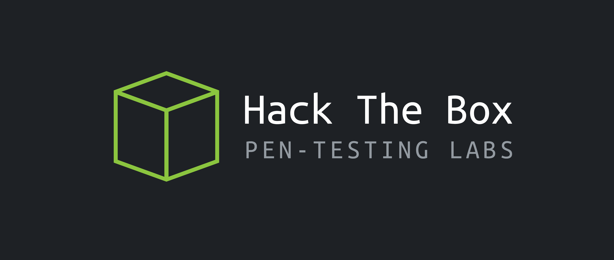

# Hack-The-Box

# 회사 소개

{: width="50%" height="50%"}

Hack The Box는 사이버 보안 기술을 테스트하고 향상시킬 수 있는 온라인 플랫폼입니다.

## 우리의 사명

우리의 사명은 배우려는 의지가 있는 누구나 무료로 액세스할 수 있는 사이버 보안 교육을 제공하는 것입니다. 이를 달성하기 위해, 우리는 지속적으로 혁신적인 학습 방법을 개발하고 커뮤니티를 위한 상호 작용하는 경험을 만들고자 합니다.
Our mission is to provide free and accessible cyber security education to anyone willing to learn. To achieve this, we are committed to continually develop innovative learning methods and create interactive experiences for our community.

## 우리의 비전

우리의 비전은 국제 사이버 보안 커뮤니티의 성장을 촉진하고 회원들이 인터넷을 더 안전한 장소로 만들 수 있도록 돕는 것입니다. 이를 위해, 우리는 혁신과 협업 문화를 조성하고 최신 사이버 보안 자원에 대한 접근을 제공하는데 전념하고 있습니다.
Our vision is to foster the growth of an international cybersecurity community, empowering its members to make the internet a safer place. To do this, we are dedicated to creating a culture of innovation and collaboration, and providing access to state-of-the-art cybersecurity resources.

## 우리의 이야기

Hack The Box는 2017년 하리스 피라리노스와 제임스 후커가 그리니치 대학에서 공부하던 동안 만난 후 설립되었습니다. 플랫폼은 처음에는 부 프로젝트로 시작되었지만 인기를 얻게 되어 2018년 회사가 설립되었습니다.
Hack The Box was founded in 2017 by Haris Pylarinos and James Hooker, who met while studying at the University of Greenwich. The platform was initially created as a side project, but quickly grew in popularity, leading to the formation of the company in 2018.

오늘날 Hack The Box는 160개 이상의 국가에서 50만 명이 넘는 회원을 보유한 글로벌 사이버 보안 커뮤니티입니다. 플랫폼은 가상 랩, 교육 과정, 경쟁 등 다양한 사이버 보안 자원을 제공합니다.
Today, Hack The Box is a global cybersecurity community, with over 500,000 members from more than 160 countries. Our platform offers a wide range of cybersecurity resources, including virtual labs, training courses, and competitions.

## 우리 팀

우리 팀은 열정적인 사이버 보안 전문가로 구성되어 있으며, 커뮤니티에 최상의 학습 경험을 제공하기 위해 헌신하고 있습니다. 우리는 지속적으로 플랫폼을 개선하고 새로운 콘텐츠를 개발하며 전 세계 사이버 보안 커뮤니티의 성장을 지원하고 있습니다.
Our team is made up of passionate cybersecurity professionals who are dedicated to providing the best possible learning experience for our community. We are constantly working to improve our platform, develop new content, and support the growth of the cybersecurity community worldwide.

